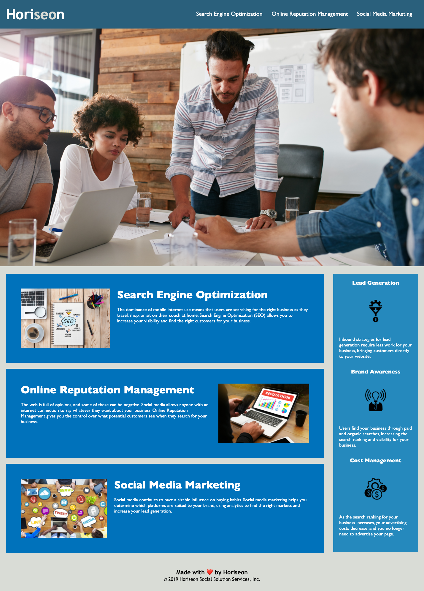

# css-demo-site
***
### This project was an activity on refactoring the CSS file along with making sure the syntax in the HTML file is inclusive to users who view screens differently. Along with this the project included making sure links worked properly and making sure the HTML file was properly written, i.e. including alt tags for images. 

***

###### [Link to deploy application!](URL "https://kemwalsh.github.io/css-demo-site/")